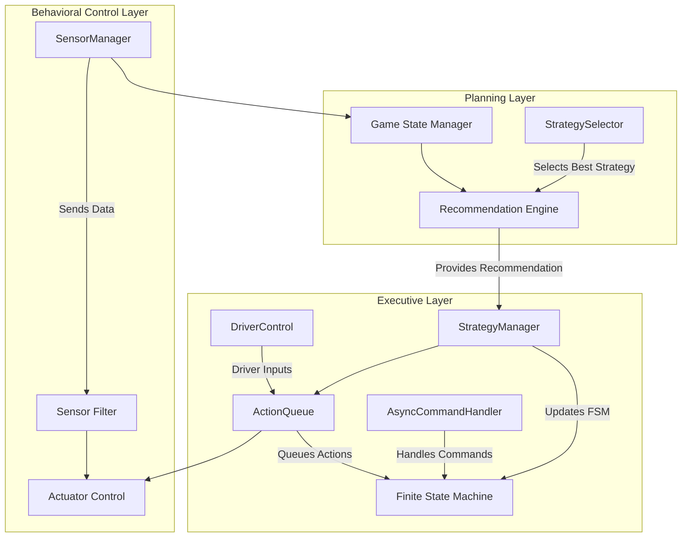
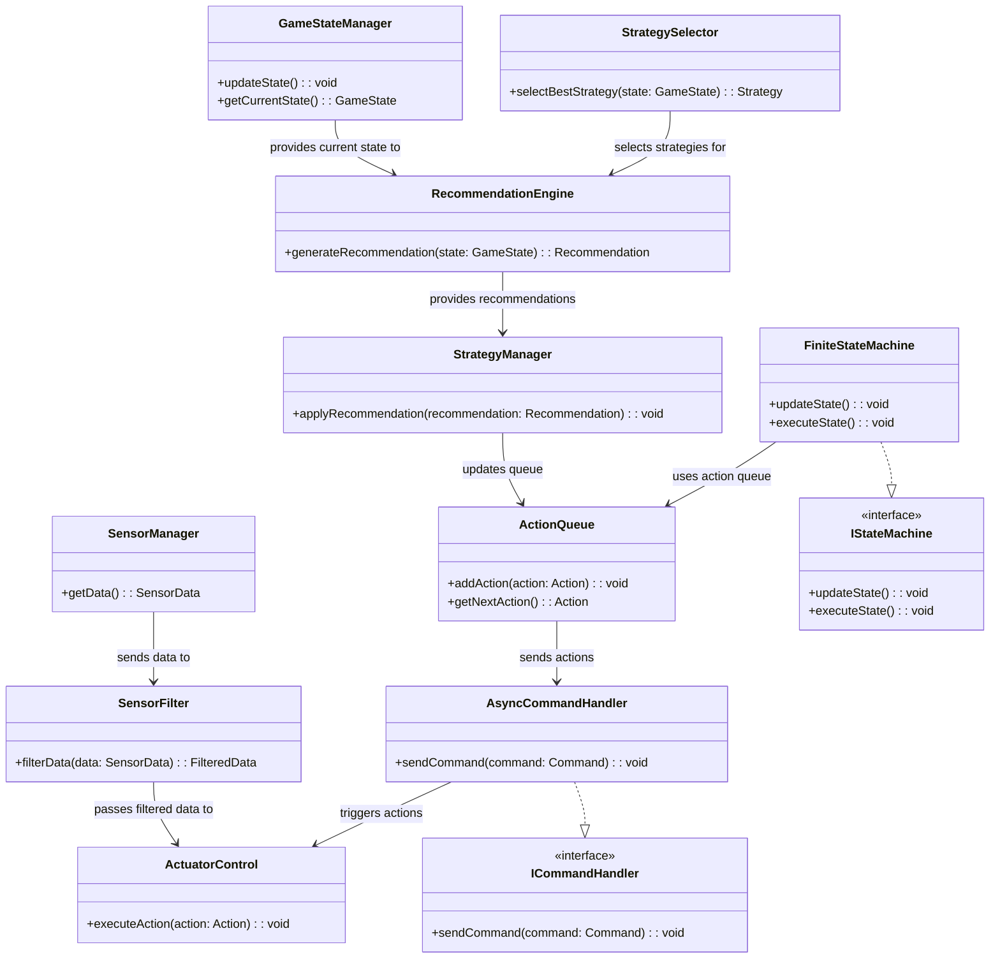

# FTC Robot System with SOLID Architecture Principles

This project is an FTC robot system designed to compete in the FIRST Tech Challenge (FTC) with high adaptability, efficient operation, and real-time strategy assistance. The system is structured following the SOLID principles to ensure modularity, extensibility, and maintainability across different OpModes (Autonomous and TeleOp). The system is compatible with the FTC SDK’s Road Runner and FTCLib libraries for optimized motion control and reusable functionality.

---

## Table of Contents
- [Overview](#overview)
- [System Architecture](#system-architecture)
- [Folder Structure](#folder-structure)
- [Usage](#usage)
- [Class Diagrams](#class-diagrams)

---

## Overview

This project’s goal is to build a robust robot system for FTC competitions, designed with three main layers:
1. **Behavioral Control Layer**: Manages sensor data acquisition and actuator control for reactive behaviors.
2. **Executive Layer**: Handles state management and action execution based on real-time game strategy.
3. **Planning Layer**: Provides game awareness and strategic recommendations to assist the driver during TeleOp mode and control strategy in Autonomous mode.

The system also supports TeleOp driver assistance by suggesting strategies and guiding actions, improving response and efficiency in competition.

---

## System Architecture

The system follows a three-layered architecture with each layer focusing on specific responsibilities. This approach helps in efficiently adapting to real-time changes on the field and enables clear separation of concerns.



### Layer Responsibilities

- **Behavioral Control Layer**: Controls all sensors and actuators, performs basic data filtering, and enables quick reactions to environmental changes.
- **Executive Layer**: Manages real-time task execution and driver inputs, delegating tasks based on state-driven logic and queued actions.
- **Planning Layer**: Assesses the game field, suggests strategic options, and adapts strategies based on game state.

---

## Folder Structure

The following folder structure is organized to facilitate the SOLID architecture:

```plaintext
FtcRobotController/
├── TeamCode/
│   ├── src/main/java/org/firstinspires/ftc/teamcode/
│   │   ├── behavioral/               # Behavioral Control Layer
│   │   │   ├── SensorManager.java
│   │   │   ├── SensorFilter.java
│   │   │   ├── ActuatorControl.java
│   │   │   └── interfaces/
│   │   │       └── ISensor.java
│   │   │
│   │   ├── executive/                # Executive Layer
│   │   │   ├── FiniteStateMachine.java
│   │   │   ├── ActionQueue.java
│   │   │   ├── AsyncCommandHandler.java
│   │   │   ├── StrategyManager.java
│   │   │   └── interfaces/
│   │   │       ├── ICommandHandler.java
│   │   │       └── IStateMachine.java
│   │   │
│   │   ├── planning/                 # Planning Layer
│   │   │   ├── GameStateManager.java
│   │   │   ├── RecommendationEngine.java
│   │   │   ├── StrategySelector.java
│   │   │   └── interfaces/
│   │   │       ├── IGameState.java
│   │   │       └── IRecommendation.java
│   │   │
│   │   ├── opmodes/                  # OpModes for FTC SDK
│   │   │   ├── AutonomousOpMode.java
│   │   │   ├── TeleOpMode.java
│   │   │   └── TeleOpModeWithAssistance.java
│   │   │
│   │   └── utils/                    # Utility classes
│   │       ├── Logger.java
│   │       └── ConfigLoader.java
│   │
│   └── src/main/res/
│       └── values/
│           └── strings.xml           # Additional resources if needed
└─── . . .
```

### Key Components

Each layer is broken down into small, role-specific classes aligned with SOLID principles to improve maintainability and extensibility.

## Usage

1. **Autonomous Mode**:
   - Register `AutonomousOpMode` in the FTC Driver Station to run the robot in full autonomous mode.
   - This mode leverages the Planning Layer to execute pre-defined strategies and dynamically adjust based on the game field state.

2. **TeleOp Mode**:
   - Register `TeleOpMode` to control the robot manually during TeleOp phase.
   - Register `TeleOpModeWithAssistance` for enhanced driver support, where the robot offers strategy suggestions and adaptive positioning.

3. **Utilities**:
   - The `Logger` class provides consistent logging across different components for easier debugging.
   - `ConfigLoader` loads game-specific configuration parameters, such as thresholds or time-based settings.

---

## Class Diagrams

### Class Diagram for SOLID-Structured Components

This class diagram shows the key classes across each layer, emphasizing modular design, interface usage, and adherence to SOLID principles.



This architecture and code structure aim to deliver a flexible, robust FTC robot system that adapts dynamically to both autonomous and driver-controlled phases with strategic assistance. 